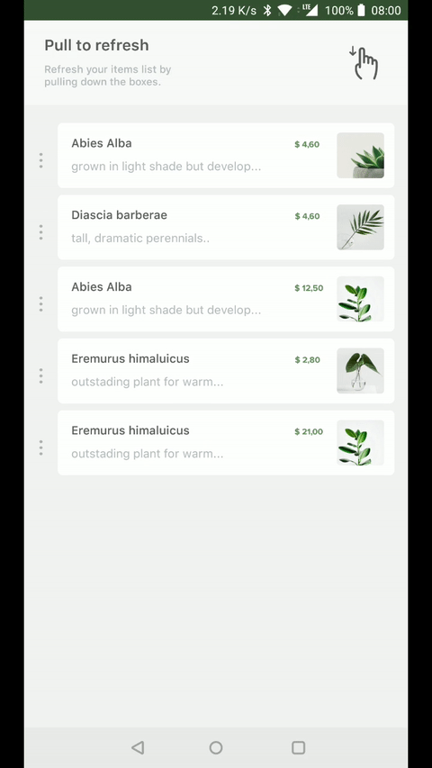

# Particles Refresh Layout  [](https://app.bitrise.io/app/45cdb1c4827b546a)[](https://bintray.com/10clouds-android/particlesrefreshlayout/particles-refresh-layout)


## Sample
<p align="center">
  
</p>


## Installation
Just use the Maven repository. Library is on jCenter and mavenCentral.

**Gradle:**
```groovy
implementation 'com.tenclouds.particlesrefreshlayout:particles-refresh-layout:{last_release_version}'
```
**SBT:**
```groovy
libraryDependencies += "com.tenclouds.particlesrefreshlayout" % "particles-refresh-layout" % "{last_release_version}"
```
**Maven:**
```groovy
<dependency>
  <groupId>com.tenclouds.particlesrefreshlayout</groupId>
  <artifactId>particles-refresh-layout</artifactId>
  <version>{last_release_version}</version>
  <type>aar</type>
</dependency>
```

## Usage
Wrap your View in **ParticlesRefreshLayout** in your layout:
```xml
<com.tenclouds.particlesrefreshlayout.ParticlesRefreshLayout
            android:id="@+id/particlesRefreshLayout"
            android:layout_height="wrap_content"
            android:layout_width="0dp">
            
        <android.support.v7.widget.RecyclerView
                android:id="@+id/recyclerView"
                android:layout_width="match_parent"
                android:layout_height="match_parent"/>
                
</com.tenclouds.particlesrefreshlayout.ParticlesRefreshLayout>
```
then listen to start refresh actions: 
```kotlin
particlesSwipeRefresh.onParticleRefreshListener = object : OnParticleRefreshListener {
            override fun onRefresh() {
                // do an action and stop refreshing after  
                particlesSwipeRefresh.stopRefreshing()
            }
        }
```
**Application with example is in [app folder](https://github.com/10clouds/ParticlesRefreshLayout-android/tree/master/app)**

## Customization
You can customize component from XML layout file, using attributes: 
```
app:accentColor="@color/accentColor"
app:isSmallSize="true"
```
or from Java/Kotlin code:
```kotlin 
particlesSwipeRefresh.accentColor = ContextCompat.getColor(this, R.color.accentColor)
particlesSwipeRefresh.isSmallSize = true
```

---
Library made by **[Jakub Jodełka](https://github.com/jakubjodelka)**